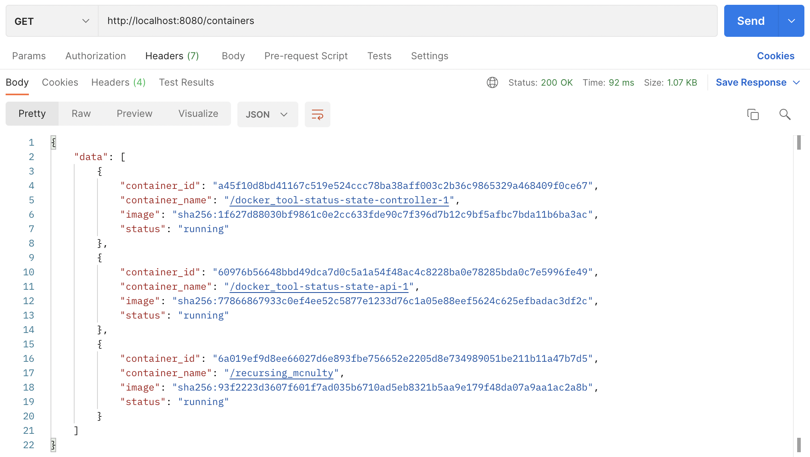

# docker_tool

This tool that will enforce that only a given list of containers will be allowed to run in your local docker host. This tool is made of two components:

- **status-state-api:** A container that listens on the port 8080 and that exposes a http endpoint that returns the status information of all docker containers running locally.

  > As I had used 'Docker SDK for Python' to manage containers using Docker Engine API, it was easy to work with one of python's web framework to create REST API that returns containers status information. I have implemented the API using the 'Flask micro web framework' written in Python.

- **status-state-controller:** A container whose role is to build and keep the status state list of the running containers.

## How to use

---

To clone and run this application, you'll need [Git](https://git-scm.com/downloads) and [Docker](https://docs.docker.com/get-docker/) installed on your computer.

#### Step 1: Start some containers on your local machine. For example:

```bash
$ docker run -it busybox sh
```

#### Step 2: Clone this repository

```bash
$ git clone https://github.com/ireshdudeja/docker_tool.git
```

#### Step 3: Change your current directory

```bash
$ cd docker_tool
```

#### Step 4: Start containers `status-state-api` and `status-state-controller` in detached mode

```bash
$ docker-compose up -d
```

#### Step 5: To see the logs from `status-state-controller` container

```bash
$ docker-compose logs -f status-state-controller
```

#### Step 6: To stop containers after testing this tool

```bash
$ docker-compose down
```

## Output

---

- **status-state-api:** Test API response from the URL `http://localhost:8080/containers` in [Postman](https://www.postman.com/downloads/) or directly in the browser

  

<br/>

- **status-state-controller:** Logs
  <br/>
  

## Deploy the tool to a kubernetes cluster

---

### _What deployment strategy you would use ?_

The process of manually updating containerized applications can be time consuming and tedious. A Kubernetes deployment makes this process automated. With Kubernetes, there are different ways to release an application by following one of available strategies.

I would prefer to deploy this tool by using Rolling Update Deployment strategy which is also the default deployment strategy in Kubernetes. I prefer this strategy because it replaces pods, one by one, of the previous version of our application with pods of the new version without any cluster downtime. This strategy also waits for the new pods to become ready via a readiness check before scaling down the old components.

Depending on the use case of this tool, other strategies can also be used. For example, if we can handle the downtime, we can also opt for Recreate Deployment strategy.

### _What tooling you would use ?_

- `kubectl`: This CLI tool will enable us to control cluster from a terminal
- `kompose`: To translate Compose Services to Kubernetes Objects

### _How the workflow would look like ?_

I am using Docker-Compose to run this tool. Containers in Docker Compose are designed to run on a single host. In contrast, Kubernetes usually is run in a highly available state with multiple servers that deploy and maintain the application to the different nodes.

- I will start with creating the Kubernetes cluster to deploy our tool. There are several services which provides Kubernetes implementation, for example: Minikube (To create cluster locally), Google Kubernetes Engine, AWS Elastic Kubernetes Service, Azure Kubernetes Service etc. Here I will specify the number of nodes the cluster will consist of.

- The smallest deployable unit in a Kubernetes cluster is a Pod. Pods are typically rolled out using Deployments, where I can specify the number of replicas I want to run in cluster.

- To run the services on a distributed platform like Kubernetes, I will need to translate Docker-Compose services definitions to Kubernetes objects. I can use `kompose` tool for this purpose. `kompose convert` command will convert services to yaml files. Then we need to make some other required changes, as this conversion will not produce the exact outcome to run directly on Kubernetes.

- To provide external access to the services in a cluster, I need to configure Ingress object.

- After making the required changes, I can deploy using `kubectl` tool.

### _How would you monitor the status of the deployment ?_

- I can use `kubectl get deployments` to check if deployment is created.
- I can also utilize [Prometheus](https://prometheus.io/) monitoring system for cluster and application-level monitoring.
